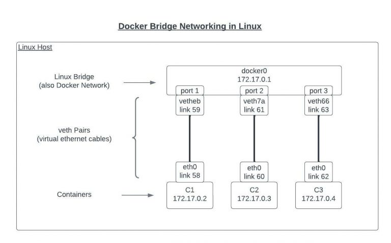

# Docker 개념 이해

* Virtualization
  * 도입 배경
    * Application 운영 과정에서 여러 개의 device가 필요한 상황이 생기는데, 이럴 때마다 device 개수를 늘리는 것은 비용적으로 큰 손해가 될 것이다.
      * ex: Application (1대) - Web Server (1대) - DB (1대)
    * 따라서 하나의 device로 여러 개의 virtual machine을 구동하는 방식으로 hardware 측면 비효율을 최소화할 수 있다.
  * Virtual Machine
    * Application, library에 guest OS 까지 포함한, 자체로 완결된 소프트웨어 환경을 구축하는 방식
    * Host OS와 Hyperviser를 사용하여 통신
    * 문제점
      * Guest OS 구동에 필요한 메모리, 파일 저장 용량 비효율
      * Guest OS가 hyperviser를 통해서 host OS로 연결하는 과정에서, 성능 측면 overhead가 증가할 수 있음
  * **Container**
    * Container는 guest OS를 포함하지 않고, container engine을 통하여 직접 host OS를 통해 구동
    * 하지만 각각의 Container에서는 application을 독립적으로 실행할 수 있음
    * VM을 사용하는 것보다 guest OS 유지로 인한 HW, SW적 비용을 절감할 수 있음
    * Container 기반 시스템 특징
      * 리눅스 커널 기능을 활용하여 개발\
        (chroot-파일 시스템 격리, namespace-프로세스 격리, cgroup-하드웨어 자원 격리)
        * **프로세스 단위의 격리 환경** (Host OS 기준)
* **Docker**
  * **개요**
    * 리눅스 컨테이너 기술(LXC) 기반 가상화 도구
    * Application을 container 단위로 격리하여 실행 및 배포
    * 다양한 운영체제 호환, 컨테이너화된 app 빌드-배포-관리의 손쉬움
    * 빠른 app 개발 및 효율적 배포, 관리 가능
  *   **Docker Architecture**

      <figure><figcaption>
Source : Docker docs
</figcaption></figure>

      * Docker Client
        * Docker CLI, Docker desktop 등을 통해 접속 및 제어
        * 명령을 보내면 Docker daemon으로 보내어 실행
      * Docker Host
        * Docker Daemon
          * Host OS의 docker host에서 생성한 container를 관리 및 실행
          * Container create, start, pause, atop, selete 작업 수행
          * Container images 관리
          * 외부 Registry에서의 images 다운로드 및 빌드 작업 수행
        * Docker Image
          * Docker container를 만들기 위한 읽기 전용 템플릿-설계도- (Java의 Class와 비슷)
        * Docker Container
          * Docker image를 통해 만들어진 실행 가능한 instance
          * App 실행을 위한 모든 파일 및 설정 정보를 포함하는 package
      * Docker Registry
        * Docker image를 저장하고 관리하는 곳
          * 회사별로 직접 만들어 관리하는 이미지들 있을 수 있으며..
          * Docker Hub
            * Default registry로, 누구나 접근 가능한 공개형 저장소
  *   **Docker Network**

      <figure><figcaption>
Source: Cisco blog
</figcaption></figure>

      * Host의 몇 번 포트와 Container의 몇 번 포트를 연결할 것이냐를 설정하고 나면,\
        Client에서 'Host IP:Port' 로 Container 연결 가능
  * Container Lifecycle
    * Create + Start = Run
    * Stopped 상태에서만 Delete 가능
    * Paused 상태에서는 Running 상태로만 돌아갈 수 있음
  * Dockerfile
    * Image 1개를 빌드할 때 사용하는 파일
      * Docker image가 금형이라 할 때, Dockerfile은 금형 설계도와 같음
      * Docker hub는 금형 창고와 같고, Dockerfile을 통해 생성 후 업로드-다운로드 가능
* Docker Container 여러개 동시에 굴리기
  * CLI로 수동 생성
    * Docker network 생성
    * Application container를 직접 선언 (docker run \~)
    * DB container를 직접 선언 (docker run \~)
      * 단, 각각 docker run의 맨 뒤에 네트워크 설정을 해주어야 함
      * App 뒤쪽 (네트워크 앞) 에서는 포트 설정도 적절하게 가능\
        (Host OS 외부 또는에 localhost에서 접속하고자 하는 경우)
  * **docker-compose.yml 작성**
    * 위에서 언급한 사항을 단 한 줄의 CLI만으로 한 번에 실행 가능
      * docker-compose -f \[yml 파일] up (-d) --build\
        (-f : docker compose 파일 지정, -d : Daemon을 이용해 백그라운드 실행)
      * docker run
        * \--name : 컨테이너의 이름 지정
        * \-v : 볼륨 설정
        * \-p : 포트 포워딩
        * \-e : 환경 변수 설정
        * \--network : 해당 컨테이너가 사용할 네트워크 설정
    * 구성 요소
      * version : Docker 자체의 버전
      * services, network(ports, expose), volume, config, secret(ev)
        * 실행하고자 하는 각각의  컨테이너들을 정의함 -> 컨테이너 생성 및 관리
        * 구성 요소 : 컨테이너이름, 이미지, build, port mapping, ev(환경변수), volume,  command, depends\_on 등
          * build : Dockerfile이 별도로 정의된 경우 해당 이미지로 빌드함
          * command : 컨테이너가 실행될 때 수행할 명령어
          * depends on : 컨테이너간의 의존성 주입, 명시된 컨테이너를 먼저 실행 및 생성함\
            (ex: depends on db -> DB를 먼저 생성 후 app container를 실행)
          * ports : 개방할 포트 지정
          * expose : link로 연계(내부 연결용)된 컨테이너에만 공개할 포트 설정
          * volume : 컨테이너에 mount할 Host OS에서의 볼륨 위치 설정
          * restart : 컨테이너 종료시 재시작 정책
            * no, always(외부,영향으로 종료된 경우 수동 종료 전까지 항상 재시작), failure(오류 있는 경우 재시작)
    * Docker network list
      * docker network ls
        * bridge : 도커 엔진에 의해 자동 생성되는 가상 네트워크. 컨테이너끼리 연결
        * host : Host OS의 네트워크 인터페이스를 그대로 사용
        * none : 네트워크 미사용
      * docker network prune
        * 어떤 컨테이너도 사용하지 않는 네트워크는 삭제
        * \+ prune (중지된 모든 컨테이너 삭제, 미사용 이미지 삭제, 미사용 볼륨 삭제, 미사용 네트워크 삭제 가능)
      * &#x20;docker network create \[network name]
