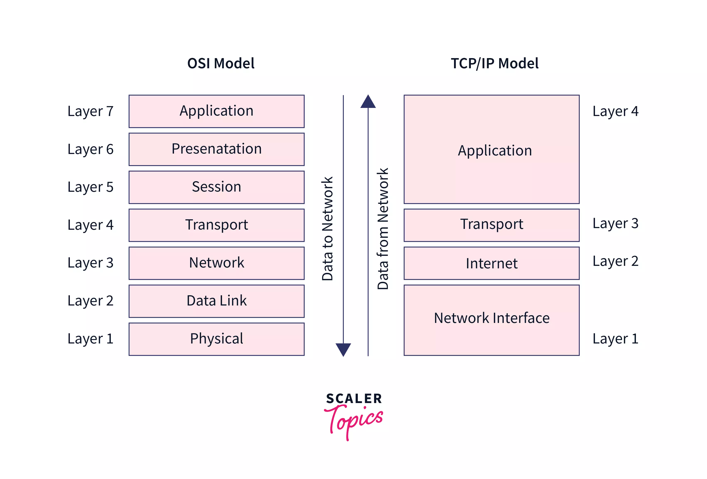

# Day 1 HTTP Basics

* Hypertext Transfer Protocol
  * Protocol : 규약, 약속
  * 컴퓨터 네트워크로 통신할 때에 사용하는 규약
*   Application Layer

    <figure><figcaption>
Open System Interconnection Model &#x26; TCP/IT Model
</figcaption></figure>

    * 본 강의에서 중요하게 보는 레이어는 2, 3, 4, 7

| Layer | OCS          | Details                                                                                                                                                                                                                                                                                                                                                                         |
| ----- | ------------ | ------------------------------------------------------------------------------------------------------------------------------------------------------------------------------------------------------------------------------------------------------------------------------------------------------------------------------------------------------------------------------- |
| 1     | Physical     | 아예 HW 적인 부분 (컴퓨터 부품 등)                                                                                                                                                                                                                                                                                                                                                          |
| 2     | Data Link    | 다른 device(HW)와 통신할 때 각 device를 정의할 수단 (MAC address)                                                                                                                                                                                                                                                                                                                             |
| 3     | Network      | 떨어져있는 device를 인식할 수 있는 주소 (IP address)                                                                                                                                                                                                                                                                                                                                          |
| 4     | Transport    | 
해당 주소에서 어떤 프로그램을 찾아가면 되는지 인식 (Port number)
<ul><li>
TCP (Transmission Control Protocol)
<ul><li>전송 제어 프로토콜. 전화와 같다.</li><li>수신자와 송신자간 '연결'이 필요</li><li>데이터 전달 여부 및 순서 확인을 보장</li></ul></li><li>
UDP (User Diagram Protocol)
<ul><li>편지-메일와 같음</li><li>수신자와 연결하지 않은 상태에서도 송신자는 데이터를 보냄</li><li>데이터 전달 여부 및 전달 순서는 보장할 수 없음 (수신자는 못 받았을 수 있음)</li></ul></li></ul> |
| 5     | Session      | 
통신을 관리하기 위하여 통신 사용자(수신자)들 정보를 송신자와 동기화함
<ul><li>과거에서는 서버에서 세션 객체를 만들어서 관리했지만, 요즘은 JWT와 같은 token을 이용하여 사용자들을 관리함</li></ul>                                                                                                                                                                                                                                                 |
| 6     | Presentation | 
사용자 시스템에서 인식할 수 있는 데이터 형식으로 송신자가 보낸 데이터를 표현해줌.
<ul><li>인코딩-디코딩, 암호화 등</li></ul>                                                                                                                                                                                                                                                                                           |
| 7     | Application  | HTTPS를 위한 TLC(Transport Layer Security) 레이어 등을 별도로 정의하기도 함 (Application Layer - Network Layer 사이)                                                                                                                                                                                                                                                                               |

* HTTP 통신 과정 요약
  * Client - Server 간에 아래의 순서로 서로를 인식하여 소통함
    * IP -> TCP -> (TLS) -> HTTP -> HTML/CSS/JavaScript/Web APIs\
      &#x20;    \-> UDP -> DNS  ->
    * 서비스, 리소스(HTTP 요청 대상) 요청은 URL로 진행
  * HTTP is **Stateless**
    * HTTP만 봐서는 이전에 만났던 그  Client가 맞는지 Server는 알 수 없음
      * \-> HTTP는 각각에 요청에 독립적임을 알 수 있음
    * 이전에 만났던 Client가 맞는지 확인하는 방법 : Request, Response Header로 소통
      * 데이터는 Server에 담겨 있지만..
      * 쿠키 : Token(key) 관리 가능 - 세션 역할
      * Brower Local Storage : 그 외 보안성 덜한 파일들
  * HTTP Message
    * 어떤 형태로든 전송 가능하나 가급적 사람이 읽을 수 있게 보냄
    * 요청 - 응답은 동일하게 아래와 같은 구조를 가짐
      * Start line
      * Headers
        * Request : Client의 상태나 특징 확인 (토큰 등을 통해)
        * Response : Server가 Client에게 Body 외적으로 전달하고자 하는 내용\
          (쿠키, 콘텐츠 타입 등)
      * Blank line
        * 빼먹으면 body 시작을 알 수 없음
      * Body
        * Header에서 Content-Length로 길이를 미리 정의하지 않으면, Client는 Body의 끝이 어디인지 알 수 없음
* HTTP Method (HTML 1.1)

| Title   | CRUD   | Details                                                                    |
| ------- | ------ | -------------------------------------------------------------------------- |
| GET     | Read   | 
멱등성이 있어 동일 요청 반복 시 늘 같은 결과를 얻음 (같은 환경에서)
                         |
| HEAD    | Read   | 
Body 없이 Head만 받음 (캐시 만료 여부 확인, 권한 얻기, Status만 받기)
                |
| POST    | Create | Submit, 단 멱등성이 없어 동일 요청 반복 시 같은 결과를 얻는다는 보장 없음                             |
| PUT     | Update | 
Overwrite, 보낸 것으로 기존 내용을 대체하며 멱등성이 있음 (늘 같은 결과)
                  |
| PATCH   | Update | Partial Update, 특정 항목만 바꾸기가 가능하나 요청 내용에 따라 멱등성 없을 수 있음 (기존 값 +10씩 하는 경우 등) |
| DELETE  | Delete | Delete                                                                     |
| OPTIONS | -      | Header 정보, POST/PUT 등 메소드 사용 가능 여부 확인                                      |

* HTTP Response
  * Status code + Status message의 형태
    * Status code가 중요, message는 그 자체가 통신 과정에서 사용하는 정보는 아님
    * Status code
      * 1xx : Information
      * 2xx : Success (200, 201, 204)
      * 3xx : Redirection (요즘은 304 NOT MODIFIED 만 뜸. 새로고침 해도 바뀐 내용이 없어서 가져올 데이터가 없는경우)
      * 4xx : Client Error (404, 401, ...)
      * 5xx : Server Error
