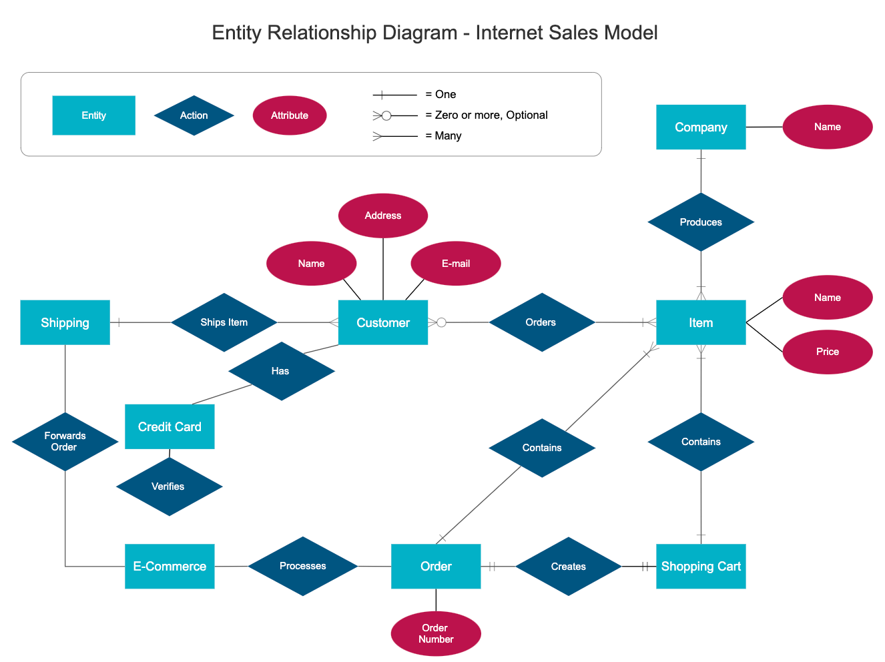

# Day 4 Entity-Relationship Model

### Entity-Relationship Model (ER Model)

* 가장 인기있는 개념적 데이터 모델 중 하나
* Entity : 개별적으로 다룰 수 있는 데이터
  * Entity Type : 같은 attribute를 가진 entity의 집합 (OOP의 Interface 개념과 유사)
    * ex> 동물 entity type은 개 entity, 고양이 entity를 포함 가능
  * ERD 등을 통해 표현하는 것은 엄밀히 Entity Type임
* Relationship : 복수의 Entity (Type) 사이의 관계

### Entity-Relationship Diagram (ERD)

* ER Model을 시각화하는 방법 중 하나

<figure><figcaption>
source : <a href="https://www.smartdraw.com/entity-relationship-diagram/">https://www.smartdraw.com/entity-relationship-diagram/</a>
</figcaption></figure>

* Entity들과 그 사이의 Relationship들을 그려줌
* 실제 개발에서는..
  * 모델을 검증하는 도구로만 사용하고, 세세한 표현법에 얽매일 필요는 없음
  * 대신, 알아보기 좋게 그리는 것이 가장 좋음
  * ERD에 얽매여서 개발 과정에 제약을 받기보다는, 객체 지향 설계를 치밀하게 하는 것이 좋을 수 있음
* ERD 그리기 연습할 때는..
  * Crow's Foot Notation보다는 정석으로 노트나 draw.io 같은 곳에 그려보는 것이 좋음

<figure><figcaption>
source : <a href="https://tdan.com/crows-feet-are-best/7474">https://tdan.com/crows-feet-are-best/7474</a>
</figcaption></figure>

#### Tips

* VO (Value Object) : Logic 내부적으로 특정한 비즈니스 로직 처리 결과값을 담아두는 객체
* DTO (Data Transfer Object) : 다른 레이어와 소통하기 위해 데이터를 담아두는 객체
