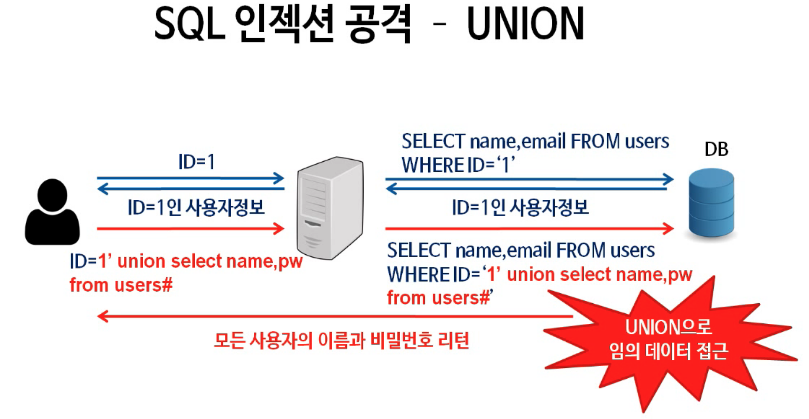

# Day 5 JDBC

### JDBC

* Java DataBase Connectivity
  * Java에서 RDBMS를 사용할 수 있게 해주는 API
  * 단, API는 결국 서버와 개발자 사이의  interface와 같으므로 JDBC를 사용하려면 DBMS별 JDBC Driver가 필요함
    * 주로 JDBC Driver는 DBMS별 vendor에서 제공
  * JDBC에서 제공하는 Connection, Statement, PreparedStatement와 같은 interface를 통해 DB 접속 - SQL Query 작성 및 execute 가능 -> Driver를 통해 구현

### Connection

* DB와 Java 서버 사이의 연결 자체를 구현함
* Parameter
  1. URL (String.class)
  2. Properties (Properties.class) -> URL에 request parameter로 보낼 수도 있음
     1. User (String.class)
     2. Password (String.class)

```java
public static void connectDatabase() {
    String url = "jdbc:postgresql://localhost:5432/postgres";
    
    Properties properties = new Properties();
    properties.put("user", "postgres");
    properties.put("password", "secret");
    
    Connection connection = DriveManager.getConnection(url, properties);
}
```

### Statement

* 연결된 DB에 SQL Query를 던지고 결과를 반환받을 수 있는 interface
* statement.executeQuery(query), statement.executeUpdate(query)
  * SQL문을 execute하는 메소드들. CUD인 경우 executeUpdate를 사용하여야 함
* ResultSet : Query의 결과인 Tuple들을 저장하는 Set을 만드는 class
  * 결과값은 주로 iteration을 통해 row 단위로 확인
  * 컬럼(Attribute) 이름 또는 해당 컬럼의 index를 통해서 해당 row에서 원하는 값을 얻을 수 있음
    * SQL문 자체에서 column 순서를 지정하여 SELECT한 경우 해당 순서로 <mark style="background-color:blue;">1부터 index를 부여</mark>

```sql
SELECT name, age
FROM student;
// name이 1번, age가 2번 index를 가지게 됨
```

### PreparedStatement

<figure><figcaption><p>source : <a href="https://www.inflearn.com/course/%ED%99%94%EC%9D%B4%ED%8A%B8%ED%95%B4%EC%BB%A4%EA%B0%80-%EB%90%98%EA%B8%B0%EC%9C%84%ED%95%9C-8%EA%B0%80%EC%A7%80/">https://www.inflearn.com/course/%ED%99%94%EC%9D%B4%ED%8A%B8%ED%95%B4%EC%BB%A4%EA%B0%80-%EB%90%98%EA%B8%B0%EC%9C%84%ED%95%9C-8%EA%B0%80%EC%A7%80/</a></p></figcaption></figure>

* DB에 던질 SQL query를 한 번에 완전하게 만들어서 보내게 되면, **SQL Injection** 이슈에 취약해짐
  * 서버 내부에서 SQL query를 구성하는 과정을 한 번 더 거치게 하는 것이 PreparedStatement라는 interface (Statement를 상속)
* SQL query의 내용을 대부분 작성해 두지만, 일부 변수의 값을 ?로 두면 실제값을 이후에 다시 넣어주어야 해당 query를 execute할 수 있음
  * PreparedStatement 사용 시 setInt(), setString() 등으로 변수의 데이터 타입까지 제한할 수 있음
  * 다만 setString인 경우 이것이 SQL문인지 아닌지 해당 메소드만으로는 판별이 어려울 수 있다.\
    하지만 PreparedStatement는 variable로 받은 값을 SQL 언어가 아닌 컴파일 언어로 처리하므로, 해당 변수의 값은 문법적인 의미를 가지지 못하게 된다.
  * PreparedStatement를 사용할 수 없는 경우에는 DB layer까지 그런 값이 들어오지 못하도록 application layer 등에서 미리 regex 등을 이용해 위험요소가 있는 값을 막을 수도 있다.
* [https://docs.oracle.com/javase/tutorial/jdbc/basics/prepared.html](https://docs.oracle.com/javase/tutorial/jdbc/basics/prepared.html)

#### Tips

* Maven -> Gradle 할 경우 short 버전으로 변경하는 규칙은 아래와 같다.

<pre class="language-gradle"><code class="lang-gradle"><strong>dependencies {
</strong><strong>    implementation 'groupId:artifactId:version'
</strong>    // 그 외 compileOnly 등..
}
</code></pre>
