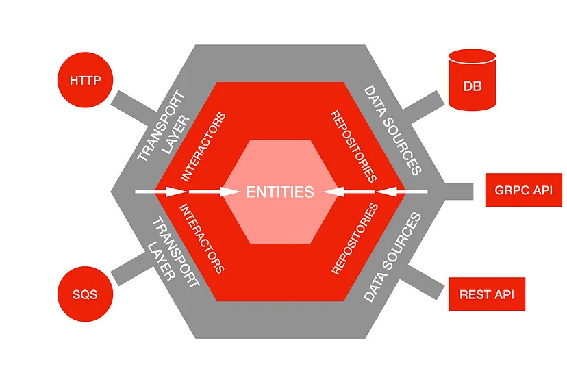

# Day 2 Hexagonal Architecture

### Hexagonal Architecture

* Alistair Cockburn이 최초 제창한 개념
* 전통 3계층
  * Presentation
  * **Domain** (Businiess logic)
  * Data
* Hexagonal Architecture 관점에서의 3계층
  * User-side
  * **Application** (Businiess logic)
    * Domain layer + Application layer : Services & Entities & Repositories
  * Database-side

<figure><figcaption>
Source : <a href="https://netflixtechblog.com/ready-for-changes-with-hexagonal-architecture-b315ec967749">https://netflixtechblog.com/ready-for-changes-with-hexagonal-architecture-b315ec967749</a>
</figcaption></figure>

* Application에는 user-side, database-side adapter들이 복수로 연결될 수 있음
  * Application 입장에서는 어느 쪽(유저-DB)이든 외부 기능
* Application과 adapter는 port를 통해 연결 -> Port는 Interface로 구현
  * Ports & Adapters Architecture
* Spring을 통해 객체간 의존성 부여를 원하는 방향으로 편리하게 조정 가능
* Hexagonal Architecture의 이점
  * UI, Infrastructure 등 기술 문제와 비즈니스 로직이 섞이는 문제를 해결
    * 테스트하기 쉽고 재사용이 용이
* UI layer에 비즈니스 로직이 없고, application layer 테스트를 위해 타 레이어(domain layer 등) 객체 mocking을 활용하고 있다면?
  * 이미 Hexagonal Architecture를 구현하는 중!
  * Application layer : port에 집중
  * Domain layer : POJO(Domain, Util 등 별도 의존성 없는 단일 객체)로 테스트하기 쉬우며 재사용하기 편리함 -> 실제 비즈니스 로직 구현하기

#### Incoming Port

* User-side
  * UI 뿐 아니라 JUnit 등을 통해서도 구현 가능
  * Port가 명확하기 드러나기 위해서는, Application에 대한 interface를 따로 정의하는 것이 좋음
    * Application이 구현하는 interface 자체가 port
  * Application이 지원하는 기능이 늘어나면? -> 해당 기능에 대한 interface를 추가 구현 -> **ISP 적용 가능**

#### **Outcoming Port**

* Outcoming Port : Database-side
  * ex: jdbcRepository(기술적)가 일반 repository(도메인 -> 비즈니스 로직)를 구현하게 만들면 **DIP 적용 가능**

#### **Tips**

* [https://github.com/ahastudio/til/blob/main/oop/glossary.md](https://github.com/ahastudio/til/blob/main/oop/glossary.md)

### 조영호, <우아한 객체지향> 세미나

[https://youtu.be/dJ5C4qRqAgA](https://youtu.be/dJ5C4qRqAgA)

TBU
