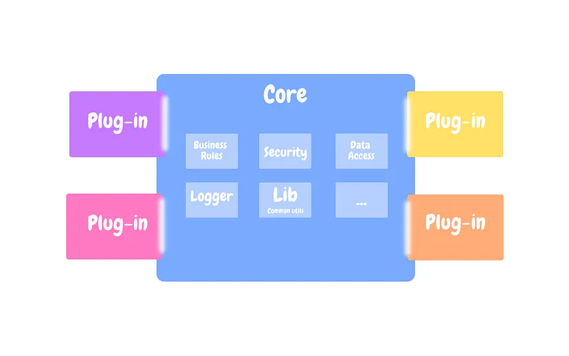

# Day 1 Dependency Injection

### Factory

* 객체 지향 프로그래밍에서 사용
* 객체를 직접 만들지 않음 ('new' 등 사용하지 않음)
* 객체를 생성하는 책임만 가진 객체를 1개 생성 -> 이를 Factory라 함
  * 단일 책임 원칙 적용 : SRP
    * [https://inpa.tistory.com/entry/OOP-%F0%9F%92%A0-%EC%95%84%EC%A3%BC-%EC%89%BD%EA%B2%8C-%EC%9D%B4%ED%95%B4%ED%95%98%EB%8A%94-SRP-%EB%8B%A8%EC%9D%BC-%EC%B1%85%EC%9E%84-%EC%9B%90%EC%B9%99](https://inpa.tistory.com/entry/OOP-%F0%9F%92%A0-%EC%95%84%EC%A3%BC-%EC%89%BD%EA%B2%8C-%EC%9D%B4%ED%95%B4%ED%95%98%EB%8A%94-SRP-%EB%8B%A8%EC%9D%BC-%EC%B1%85%EC%9E%84-%EC%9B%90%EC%B9%99)
* Factory는 Application 내 기능별 객체들(단일 책임 원칙 적용됨)을 하나하나 만들 수 있음
* Application 실행 시 한 번 이상 생성되어야 하는 객체들(설정 클래스, Controller 등 기능 구현 클래스)을 (Spring) Bean으로 등록하여 관리
* 객체를 Factory를 통해서 얻으면, Application에서 사용하는 모든 객체를 Singleton처럼 다룰 수 있어 자원 효율성이 높아짐
  * ex> UserRepository 객체 하나 생성해서 여기저기(UserService, BoardService 등) 쓰기 가능

```java
// Factory에 Bean 등록하기

DefaultListableBeanFactory beanFactory = new DefaultListableBeanFactory();

GenericBeanDefinition beanDefinition = new GenericBeanDefinition();
beanDefinition.setBeanClass(PostController.class);

beanFactory.registerBeanDefinition("postController", beanDefinition);
```

### Pluggable Architecture

*

    <figure><figcaption><p>출처 : <a href="https://medium.com/omarelgabrys-blog/plug-in-architecture-dec207291800">https://medium.com/omarelgabrys-blog/plug-in-architecture-dec207291800</a></p></figcaption></figure>
* Core System을 중심으로, 특정한 기능을 수행하는 Plug-in들을 다수 추가할 수 있는 구조
* 각각의 Plug-in 간에는 의존성이나 연관관계가 없어야 함 (그래야 독립적인 작동 및 관리 가능)
* Spring Framework 기준으로는 DAO 등 DB에 접근하기 위한 객체에 다양한 Domain Object(주로 Service)가 연결될 수 있으며, 각각의 Domain Object들은 서로 독립적으로 존재함

### Inversion of Control (IoC)

* 제어 반전, 제어의 역전, 역제어 등으로 불림
* Framework 사용 시 개발자가 직접 코드를 작성한 대로 작동하는 것이 아니라,\
  Framework 자체에 내장된 코드를 작동하여 기능을 구현함
  * ex> Framework를 구현하는 객체들이 각자의 메소드 등을 실행하여 기능 작동
* 이를 통해 내(개발자)가 아닌 Framework가 기능을 제어하게 되는 현상을 IoC라고 함
  * Library는 기존에 작성된 코드를 사람이 작동하여 사용함 (어디에서 무슨 코드 사용 등으로)
  * 단순히 함수 하나 꺼내쓰는 정도가 아니라 아예 객체가 생성되고 그 객체가 기능을 수행하고... 정도의 현상이 일어나는 것은 이미 IoC이고, IoC가 일어난다는 것 자체가 Framework임을 의미함

### Dependency Injection (on Spring)

* [https://velog.io/@gillog/Spring-DIDependency-Injection](https://velog.io/@gillog/Spring-DIDependency-Injection)
* IoC를 Spring에서 구현하는 방식 (여타 Web Framework와 구별되는 특징)
* A 객체에서 B, C 객체를 사용해야 할때, A 객체 내부에서 B, C 객체 instance를 새로 만드는 것이 아니라 이미 Spring IoC Container(Spring에서 사용하는 Bean Factory)에 생성된 B, C 객체를 생성자로 받아 A 객체를 만들어 준다.
* 이 경우 A 객체는 B, C 객체를 직접 만든 것이 아니라 외부에서 주입받은 것으로, 이를 통해 의존성(타 객체와의 관계)을외부에서 주입받았다고 할 수 있다.
* Spring IoC Container는 이와 같은 객체의 생성 또는 소멸의 과정을 관리하여 주는 Framework이며, @SpringBootApplication이라는 annotation을 사용하여 ApplicationContext라는 interface를 구현한다.

### Test Code

* Given - When - Then을 정의하여 실제 현상이 이에 맞는지 확인하기 위한 코드.
  1. Given : 700W 전자렌지 준비
  2. When : 3분간 돌림
  3. Then : 완성
* 테스트 클래스 내 메소드들은 모두 격리되어독립적으로 작동하며, 별도로 정의하지 않으면 실행 순서도 따로 없다.
  * 메소드 간 실행 순서를 조절하고자 하는 경우 @BeforeEach 같은 annotation을 사용한다고 한다.
* @DisplayName
  * 테스트 작동 후 결과를 확인할 때에 해당 테스트 메소드의 이름과 함께 확인할 수 있다.
  * 주로 해당 메소드가 테스트하고자 하는 내용에 대해 개발자(사람)가 알아보기 쉽게 서술한다.

### 왜 Spring을 사용하는가?

* Spring에서는 Java Config로 Bean definition 가능
* 단순 Bean Factory 기능을 넘어 전체 코드에서 @Bean, @Configuration, @Component 등의 annotation이 달린 class나 method를 찾아내고(@ComponentScan 기능), 이들을 Spring Bean으로 지정하여 Spring IoC Container  (**ApplicationContext** interface로 구현되는 BeanFactory class 자체) 내에서 Singleton으로 관리함 -> 개발자는 그저 @SpringApplication annotation 만 활용하여 관리 가능
* Spring 없이 이를 구현하게 되면, Layered Architecture 적용 등으로 인해 Class 개수가 많아질수록 세세한 객체 관리가 어려워짐

#### Annotation 복습

| Annotation 이름  | 사용 대상                        | 설명                                                                                                                                  |
| -------------- | ---------------------------- | ----------------------------------------------------------------------------------------------------------------------------------- |
| @Bean          | Method                       | @SpringApplication class에 생성하는 메소드 중 특정 클래스를 return하는 것은, Spring IoC Container 내부에서 Singleton으로 관리할 해당 클래스의 설정을 별도 지정하기 위해 사용할 수 있음 |
| @Configuration | Class                        | Spring 전체 설정을 위한 interface (ex: WebConfigMvc)를 @SpringApplication class 내부가 아니라 별도 Class를 구현하여 Spring IoC Container에 넣고자 하는 경우 사용함  |
| @Component     | Class                        | 설정 관련이 아니지만 Web Application 동작을 위해 필요한 구성요소 class를 Spring IoC Container에 등록하기 위해 사용함 (ex: Controller, Service, Repository)          |
| @ComponentScan | Class (Spring IoC Container) | 이 annotation이 붙은 클래스를 실행할 경우 프로젝트 내부의 조건(Annotation 자체 parameter로 받음)에 맞는 Spring Bean을 모두 스캔하여 Spring IoC Container 내부에 등록함         |

#### Troubleshooting & Additional Tips

* Bean 정의가 이중으로 된 클래스가 존재하는 경우 : Amboguous 하다는 에러 발생
* @Bean 으로 작성한 특정 클래스의 컨테이너 내 생성 메소드의 return 을 null로 정의한 경우 : Fail to instatiate
* 그 외에 기본 생성자가 없다는 에러가 나기도 한데, 이 경우 해당 클래스의 생성자에 있는 모든 클래스들을 Spring Bean으로 등록해 주어야 한다.
* 특정 클래스의 여러 구현 방식 중 하나를 선택해야 하거나, 특정 값을 선택하여 build하여야 하는 경우 -> 외부 xml 파일이나 환경변수 등을 활용
* "String".repeat(n) -> 해당 String 객체를 n번만큼 반복할 수 있는 메소드
  * 터미널의 기본 너비는 80글자(반각 문자 기준으로 추정)라고 한다.
* POJO -> Spring의 특징
  * [https://velog.io/@galaxy/Spring%EC%9D%98-%EA%B8%B0%EB%B3%B8-%ED%8A%B9%EC%A7%95-POJO](https://velog.io/@galaxy/Spring%EC%9D%98-%EA%B8%B0%EB%B3%B8-%ED%8A%B9%EC%A7%95-POJO)
  * 필요한 클래스를 일일이 상속받아 코드량을 늘리는 것보다, annotation 등을 통해 필요한 객체를 주입받는 식으로 사용하면 코드 유지보수가 훨씬 편리함
  * POJO를 알차게 구현하려면, Java 코드 내에 Bean 설정 내용이 있는 것보다는 xml 등을 통해 외부에서 별도 정의하는 것이 맞음
  * 하지만 최근에는 @ComponantScan과 같은 annotation을 이용하여 Spring Bean 설정 등을 해주고 있음 -> 완전한 POJO는 아님. 편의성을 위해 일부 희생한 부분.

