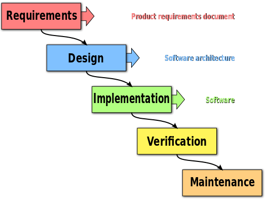
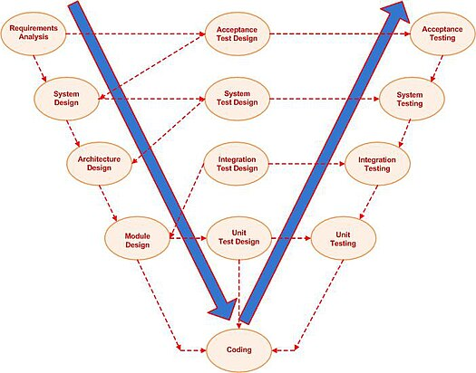
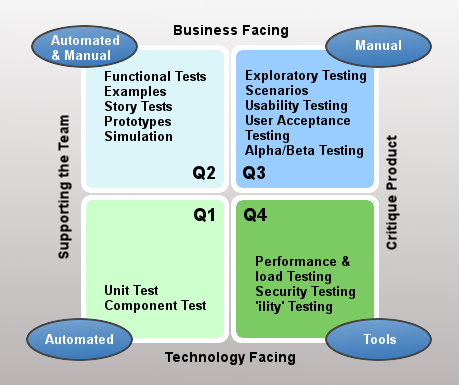
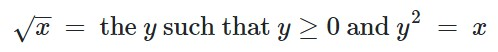

# Day 2 Unit Test

### V 모델

* 폭포수 모델을 확장한 형태 중 하나
  * 폭포수 모델 : 순차적인 소프트웨어 개발 프로세스로, 진행 중인 단계가 완료되기 전까지 다음 단계 이동이 불가능.

<figure><figcaption>
폭포수 모델 (출처 : 위키백과)
</figcaption></figure>

<figure><figcaption>
V 모델 (출처 : 위키백과)
</figcaption></figure>

* 단계별로 개발을 진행한 후, 테스트는 역순으로 진행함

#### 소프트웨어 개발 단계

표 상단에 가까울수록 사용자 관점에 가까우며, 하단에 가까울수록 개발자(기계) 관점에 가까움

| 개발 단계   | 주목적                                | 테스트 단계  |
| ------- | ---------------------------------- | ------- |
| 요구사항 분석 | 사용자 요구 달성 (QA 등)                   | 인수 테스트  |
| 시스템 설계  | 시스템 사양 결정 (E2E)                    | 시스템 테스트 |
| 아키텍처 설계 | 고수준 설계 (Spring 등)                  | 통합 테스트  |
| 모듈 설계   | 
저수준 설계 (Class, Method 등)
 | 단위 테스트  |
| 구현      | -                                  | 개발 (코딩) |

### 내부 품질 vs. 외부 품질

* 외부 품질
  * 소프트웨어의 기능 작동 여부, 속도 등 사용자 입장에서의 품질을 의미
  * 일반적으로 생각하는 '품질'의 개념
* 내부 품질
  * 소프트웨어의 내부 구성이 잘 되어 있는지 여부를 의미
  * Clean Code 개념은 내부 품질 개선을 위한 것으로, 사용자에게 직접 드러나는 사항은 아님
  * 장점
    * 협업에 유리 (코드를 알아보기 쉬움)
    * 유지보수에 유리 (문제사항 대응, 업데이트 등이 보다 편리)
    * 결과적으로 외적 품질 유지에도 유리

<figure><figcaption>
Agile Testing Quadrants (출처 : <a href="https://www.professionalqa.com/agile-testing-quadrants">https://www.professionalqa.com/agile-testing-quadrants</a>)
</figcaption></figure>

* 1분면 방향으로 갈수록 비즈니스 중심, 3분면 방향으로 갈수록 프로그래밍 중심

### JUnit 5 (Unit Test)

* Java 코드의 자동화된 모든 테스트를 지원
  * 단위 테스트 뿐만 아니라 통합 테스트, E2E 테스트까지 지원 (DSR 구성하여 사용 -> DSR : E2E 테스트 종류 중 하나인듯)
* 단위 테스트
  * 믿고 쓸 수 있는 부품인가?
  * 믿고 쓸 수 있는 부품이 있다면 어떻게 사용할 것인가? 를 판단
* SUT (System Under Test)
  * 테스트하고자 하는 class의 field name을 보통 sut로 지음

#### SICP (CS 전공도서 : [Structure and Interpretation of Computer Programs](https://sicp.sourceacademy.org/index.html)) 1.1.7

* **Square Roots by Newton's Method**

<figure><figcaption></figcaption></figure>

* 개요
  * 이 공식을 활용하는 클래스와 내부 메소드를 개발하였을 때, 개발한 코드를 통해 구한 y가 x의 제곱근이 맞는지 '테스트'하고자 함
  * 올바른 기능 구현을 위하여, 기능 사용 중 잘못될 수 있는 최대한 많은 경우의 수를 생각하여 테스트 케이스 작성
* 단위 테스트 작성을 위한 고려사항
  1. 올바른 조건문 (GoodEnough)
  2. 조건을 만족하지 못하는 경우 적용할 개선 과정 (Improve)
* 조건문을 달성할 때까지 Iteration 진행한 결과를 테스트 코드로 판정
  * 어느 정도면 '충분히 좋다'고 판정할 것인가? -> 오차 범위 (epsilon)
    * DecimalFormat class를 활용하여 소수점 n의 자리까지 만족하는 경우 pass 와 같이 설정할 수 있음
  * 테스트 통과한 모듈 -> 기능이 검증된 부품
  * 테스트를 통해 Improve 로직이 정상 작동하는지 확인하며 개선

#### 단위 테스트 구현 과정

* Annotations
  * @Test : JUnit 테스트 메소드임을 명시함
  * @DisplayName : 테스트 메소드 실행 결과를 콘솔 또는 IDE에서 확인할 때 함께 볼 수 있도록 테스트 메소드에 대한 설명 추가
  * @BeforeEach : 모든 테스트 메소드 시작 전 기본적으로 실행해야 하는 메소드를 정의 (Instance 생성, 초기값 등록 등)

#### Tips

* IntelliJ에서 메소드 위 빈 줄에서  <mark style="background-color:blue;">/\*\*</mark> 를 작성 후 엔터키를 치면 메소드 설명용 주석 템플릿이 자동 생성됨
  * @Param : 메소드파라미터별 설명
  * @Return : 메소드 리턴값 설명
* Immutable하게 테스트 클래스 내부에서 계속 사용할 instance는 가급적 static final로 선언하기
* 위에 있는 코드는 아래에 있는 코드들을 활용하도록 한다 <- 를 전제로 메소드간 위치 정리\
  (필드, 생성자 선언 정도만 예외)

<figure><figcaption>
Test Pyramid (source : <a href="https://www.headspin.io/blog/the-testing-pyramid-simplified-for-one-and-all">https://www.headspin.io/blog/the-testing-pyramid-simplified-for-one-and-all</a>)
</figcaption></figure>

* Test Pyramid
  * 위로 갈수록 통합적이고 아래로 갈수록 (기능별) 고립되어 있으며,\
    위로 갈수록 테스트 진행 속도가 느리며 아래로 갈수록 속도가 빠르다.
* 유닛 테스트를 많이 해두면 위쪽 테스트들은 훨씬 더 적게 할 수 있음
  * 부품의 신뢰성이 높으면 조립한 제품도 신뢰성이 높아짐
