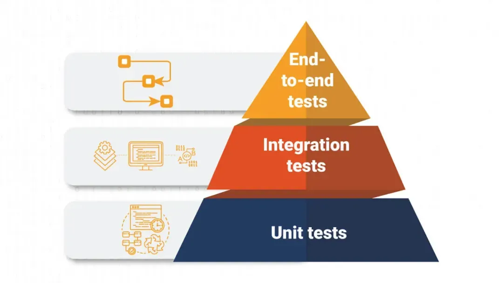

# Day 3 Spring Test

### Spring Test <a href="#spring-test" id="spring-test"></a>

1. Unit Testing → Mock object 생성하여 진행
2. Integration Testing → Spring IoC Controller Context를 생성하여 진행. DB 연결도 고려함

* 테스트 코드 작성 : 개발자가 원하는 시나리오를 검증하는 과정
* Spring은 코드 자체에 개입하는 것이 적은 framework로, dependency 정의 및 annotation 만으로 적용할 수 있음
  * 단위 테스트 작성에 유리
* Spring의 힘을 빌려 테스트해야 하는 경우 → IoC Container를 올려봐야 하는 경우, 또는 Spring Web MVC를 활용해 구현한 부분 → 통합 테스트로 검증함
  * Controller 테스트부터 보통 통합 테스트라고 함 (모든 Layer를 검증해야 함 → MockMvc 객체 사용)
* 그 외 가능한 테스트
  * Smoke Test : Spring IoC Container Context를 load한 결과 원하는 객체가 잘 생성되는지 확인
* 작은 규모의 테스트일수록 개수를 많이 만들어야 함
  * 작은 규모의 테스트를 많이 만들어서 충분히 부품들을 검증할수록 상위 테스트 수는 줄어들게 됨

<figure><figcaption></figcaption></figure>

#### @SpringBootTest <a href="#springboottest" id="springboottest"></a>

* Spring Boot 1.4부터 사용 가능
* 테스트 할 때마다 Spring IoC Container를 생성
* WebEnvironment 파라미터로 해당 컨트롤러가 사용할 포트번호 정의할 수 있음
  * RANDOM\_PORT로 지정하면 알아서 충돌 일어나지 않는 포트번호를 임의로 지정하여 테스트 할 때마다 서버 실행
  * Class 내부 field에 @Value(${local.server.port}) 로 지정하면, 현재 서버의 포트번호를 해당 field의 값으로 가져옴
* E2E Test 구현하기
  * @Autowired 등으로 해당 Test class에 TestRestTemplate field의 의존성 주입
  * TestRestTemplate
    * [TestRestTemplate (Spring Boot 3.0.6 API)](https://docs.spring.io/spring-boot/docs/current/api/org/springframework/boot/test/web/client/TestRestTemplate.html)
    * 클라이언트로부터의 REST request를 구현하여 테스트 가능
    * 응답도 REST response로 받으므로 이를 parsing하는 과정이 필요함

| **HTTP method** | **메소드명**                                                                                   |
| --------------- | ------------------------------------------------------------------------------------------ |
| GET             | <p>getForObject(url, class)<br>→ Response를 parsing할 class를 지정할 수 있음 (ex: String.class)</p> |
| POST            | postForLocation(url, Dto) → Dto로 body에 담을 데이터를 Json 형태로 전송 가능                              |
| PATCH           | patchForObject(url, Dto, class) → Dto로 수정할 데이터를 전송한 다음 원하는 class로 response parsing         |
| DELETE          | delete(url) → 해당 url + DELETE method 요청                                                    |
| HEAD            | headForHeaders(url) → 해당 url을 GET으로 호출했을 때 받는 header 정보만 표시                                |
| OPTIONS         | optionsForAllow(url) → 해당 url로 받을 수 있는 메소드를 모두 표시                                          |

```java
    @Test
    public void post() {
        String url = "http://localhost:" + port + "/posts";

        PostDto postDto = new PostDto("ID", "새 글", "ㅇㅅㅇ");
        restTemplate.postForLocation(url, postDto);
        assertThat(postDto.getContent()).contains("ㅇㅅㅇ");

        String body = restTemplate.getForObject(url, String.class);

        assertThat(body).contains("새 글");
        assertThat(body).contains("ㅇㅅㅇ");

        String id = findLastString(body);

        restTemplate.delete(url + "/" + id);

        body = restTemplate.getForObject(url, String.class);

        assertThat(body).doesNotContain(id);
        assertThat(body).doesNotContain("새 글");
        assertThat(body).contains("내용");
```

### MockMvc <a href="#mockmvc" id="mockmvc"></a>

* TestRestTemplate 객체를 사용하는 것보다 Client에서 REST 요청을 서버에 주는 과정을 보다 간결한 코드로 작성하여 흉내(mocking)낼 수 있음
* MockMvcRequestBuilder
  * get, post, put, patch, delete 등 구현 가능한 메소드 보유
* MockMvcResultMatcher
  * status, content 등 MockMvc에 request를 던진 결과 들어오는 response 중 원하는 부분을 확인하는 메소드 보유
* 주의사항
  * MockMvc를 통해서 한글 등 비영어 텍스트를 보내면, charset 문제가 발생할 수 있음
    * application 설정 파일(.properties, .yml, .. etc)에 servlet 인코딩 설정을 변경하여야 함\
      (MockMvc class 자체 문제)
    * server.servlet.encoding.force=true

#### @SpyBean <a href="#spybean" id="spybean"></a>

* Bean 내부에서 어떤 메소드가 호출되는지 기록할 수 있는 기능
  * 실제 사용하는 객체를 통해 만들어낸 Proxy object를 통해 내부 구조를 파악하고 일종의 로그를 남기면서 기록하는 것으로 보임
* 많이 쓰는 예시
  * verify(테스트하고자 하는 메소드를 가진 class).method(any(Class))
    * 테스트하고자 하는 메소드를 가진 class가 method를 실행하여 Class 타입의 parameter를 무사히 받았는지 판정
    * any() 대신 argThat()을 통해 parameter로 들어간 객체가 내가 원하는 조건에 맞는지 판정할 수도 있음
* 강의 내용 일부 백업 : private로 정의된 객체의 field의 값을 getter 없이 가져오는 메소드

### Web MVC Test <a href="#web-mvc-test" id="web-mvc-test"></a>

* 특정 기능 구현을 위해 사용 가능한 레이어를 전부 구현하면서 테스트할 수 있어야 함
* MockMvc를 통한 테스트만 가능
* @WebMvcTest(Class.class)
  * [WebMvcTest (Spring Boot 3.0.6 API)](https://docs.spring.io/spring-boot/docs/current/api/org/springframework/boot/test/autoconfigure/web/servlet/WebMvcTest.html)
  * Class의 메소드 등 기능을 테스트
  * 해당 Class가 의존하는 모든 object field를 @MockBean으로 정의하여 채워주어야 함
* 현재 테스트 중인 Class가 아닌 MockBean으로 생성된 객체는 실제 기능을 할 수 없음
  * 테스트 케이스에 사용할 given case를 정의해 주어야 함
    * \~\~ 메소드에 \~\~파라미터를 넣었을 때 \~\~를 return함 ← given case
    * given().andExpect()\~\~ 등을 활용하여 정의
    * 그 외 @SpyBean과 함께 사용하던 메소드들도 다 사용 가능
* 왜 불편하게(?) MockBean을 사용하여 테스트하는가?
  * 우리가 테스트하고자 하는 클래스의 기능만 **격리**하여 테스트 가능\
    (Controller class를 테스트 중인데 Service class의 문제로 테스트 fail하는 상황을 방지한다는 뜻)

```java
    @Test
    @DisplayName("게시물 수정")
    void update() {
        given(postRepository.find("2"))
                .willReturn(
                        new Post(
                                PostId.of("2"),
                                PostTitle.of("내가 첫 글???"),
                                PostAuthor.of("김종희"),
                                MultilineText.of("신난닷!!\n너무 좋아용~~!!")));

        PostUpdateDto postUpdateDto = new PostUpdateDto("새로 글 쓰기", "새로 글을\n쓰는 중입니다.\n\n좋아용");
        
        PostDto postDto = updatePostService.updatePost("2", postUpdateDto);

        verify(postRepository).save(any(Post.class));
        assertThat(postDto).isNotNull();
        assertThat(postDto.getTitle()).contains("새로");
        assertThrows(PostNotFound.class, () -> updatePostService.updatePost("3", postUpdateDto));
    }
```

#### Tips <a href="#tips" id="tips"></a>

* .stream().sorted() : [\[Stream\] Java Stream 정렬(sort) 사용법(sorted)(1)](https://ssamdu.tistory.com/7)
  * 필요 시 Comparator로 정순-역순 정렬도 가능\
    (직접 Comparator 객체를 신규로 정의할 수도 있고, 해당 객체가 String인 경우 compareTo 메소드를 사용하여 사전식으로 정렬할 수도 있고, 해당 객체에서 특정 필드를 get 하여 그 필드의 값으로 정렬하는 것도 가능)
* POST 결과 검증 시, POST method 실행 앞뒤로 GET list method를 실행하여 return되는 list의 size가 1 증가하는 경우 올바르게 작동하였다고 판단할 수도 있음
