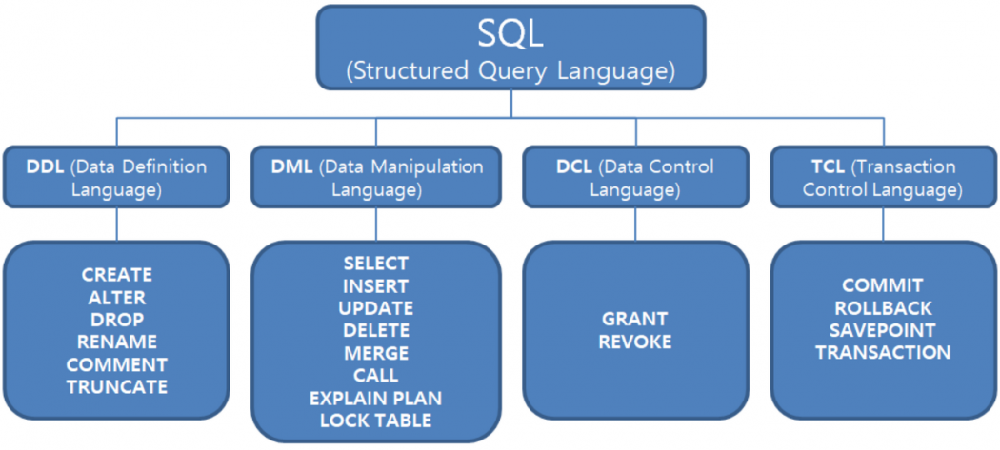

# Day 1 Database

### Database

* 구조화를 통해 정리정돈된 정보
* 데이터의 조직화된 모음
* 보통 컴퓨터 시스템에 전자적으로 저장된 것을 의미\
  (다이어리에 전화번호 적어둔 것도 Data이지만 Database라 하기에는 애매할 수 있음)
  * 컴퓨터 시스템에서 Database를 사용하기 위해 쓰는 것 : DBMS (DB Management System)
    * 개발 과정에서 일컫는 DB는 보통 DBMS (DBMS를 통해 DB 속 데이터를 접근, 조작 가능)

### DBMS

* 데이터베이스 언어를 통해 데이터를 찾거나(Read) 조작(Create, Update, Delete)하는 것이 가능함
* 일반적으로 RDBMS를 가장 많이 사용함
  * Relational Database Management System : Relation Data Model을 사용하는 DB의 MS
* DBMS의 종류
  1. DDL(Data Definition Language) : Schema를 조작
  2. DML(Data Manipulation Language) : Query & Command
  3.  DCL(Data Control Language) : Grant(권한 부여), Revoke(권한 삭제), Commit(Transaction 완료 및 데이터 변경 허용), Rollback (Transaction 중단 및 데이터 변경 미허용)

      * 보통 DDL을 제외한 나머지를 SQL로 뭉뚱그려서 표현하기도 함
      * SQL : 원래 SEQUEL이라는 언어였으며, 나중에 Structured Query Language라는 해석이 생김
      * Commit, Rollback 등   TCL(Transaction Control Language)는 별도로 분리하기도 함

      <figure><figcaption>
source : <a href="https://itwiki.kr/w/SQL">https://itwiki.kr/w/SQL</a>
</figcaption></figure>
